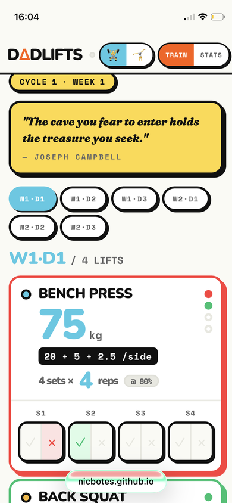
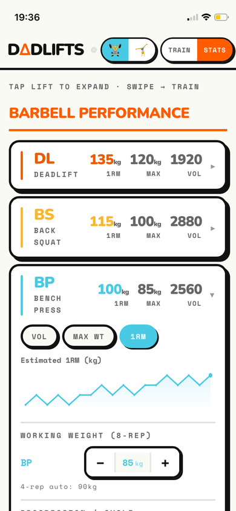
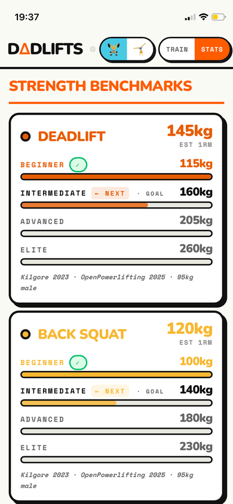
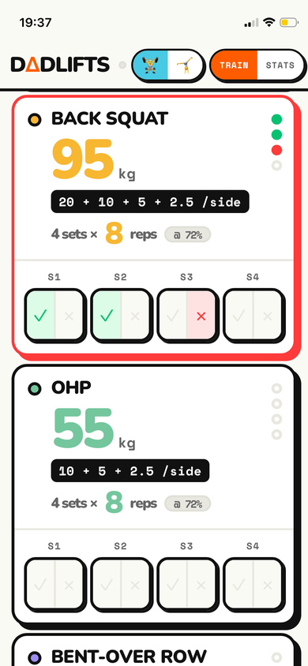
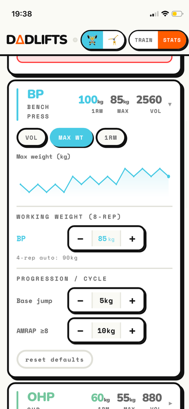

# DΔDLIFTS 🏋️

Personal training tracker. Barbell + calisthenics. Built between sets, to stay in the game.

**Live PWA:** https://nicbotes.github.io/dadlifts/

---

## Screenshots

<div align="center">

| Train | Stats | Benchmarks |
|:---:|:---:|:---:|
|  |  |  |

| Fail modal | Chart |
|:---:|:---:|
|  |  |

</div>

---

## What it is

A home screen PWA for tracking the [Ivysaur 4-4-8](https://www.liftosaur.com/programs/ivysaur-4-4-8) barbell programme alongside a calisthenics skill progression stack.

**Barbell:** Deadlift · Back Squat · Bench Press · OHP · Bent-Over Row  
**Calisthenics:** Front Lever · Dead Hang · Wall Handstand · Wall HSPU · L-Sit · Muscle-Up

**Install:** Open https://nicbotes.github.io/dadlifts/ in Safari → Share → Add to Home Screen

---

## Architecture

```
GitHub Pages PWA (standalone, localStorage)
        +
VPS (Express + SQLite, multi-tenant token URLs)
```

- **Standalone mode** (`VITE_STANDALONE=true`) — pure localStorage, no backend, works offline
- **VPS mode** — API-backed, multi-user, each user gets a unique token URL

---

## Programme: Ivysaur 4-4-8

3 days/week, 2-week rotating cycle (6 sessions):

| Day | Schedule |
|-----|----------|
| W1·D1 | Bench 4×4 · Squat 4×8 · OHP 4×8 · Rows 4×4 |
| W1·D2 | Bench 4×8 · Deadlift 4×4 · OHP 4×4 · Rows 4×8 |
| W1·D3 | Bench AMRAP · Squat AMRAP · OHP 4×8 · Rows 4×4 |
| W2·D1 | Bench 4×8 · Deadlift 4×8 · OHP 4×4 · Rows 4×8 |
| W2·D2 | Bench 4×4 · Squat 4×8 · OHP 4×8 · Rows 4×4 |
| W2·D3 | Bench 4×8 · Deadlift AMRAP · OHP AMRAP · Rows 4×8 |

- **4-rep days:** 80% 1RM
- **8-rep days:** 72% 1RM
- **2 fails on same lift** = deload flag = hold weight next cycle

---

## Stack

- **Frontend:** React 18 + Vite
- **Backend:** Express + SQLite (better-sqlite3)
- **Auth:** 256-bit token in URL path
- **Deploy:** GitHub Actions → GitHub Pages (standalone) + PM2 on EC2 (VPS)

---

## Agent / OpenClaw

See [AGENTS.md](AGENTS.md) and [SKILL.md](SKILL.md) for how the OpenClaw agent reads and updates training data.

```bash
# Redeploy
node cli/deploy.js

# Add a user
DADLIFT_BASE_URL=http://your-vps node cli/setup.js --name "Name"

# Read training data
node cli/dadlift.js snapshot
```
